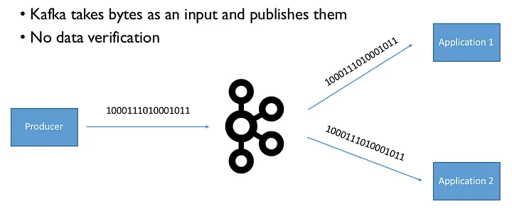
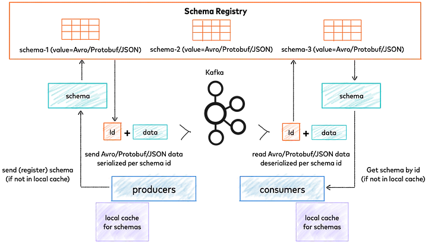

O Kafka, fundamentalmente, opera com um modelo de publicação/assinatura (PubSub) e transmite mensagens como sequências de bytes, mantendo-se agnóstico quanto ao conteúdo trafegado. Esta característica é crucial para sua notável performance. Contudo, durante a serialização, o Kafka converte as informações em bytes para transmissão, exigindo que o consumidor realize a desserialização desses bytes para um formato legível.

Esta arquitetura desacoplada de produtores e consumidores, embora poderosa, apresenta desafios significativos. O mais crítico deles é a alteração ou remoção de campos nos dados transmitidos. Tais mudanças, frequentemente resultantes de comunicação inadequada ou documentação insuficiente, podem comprometer seriamente a integridade de qualquer arquitetura de software.


<div align="center">O Kafka trabalha com os conceitos de PubSub e ao transmitir as mensagens como bytes, ele não tem visão do conteúdo que está sendo trafegado.</div>

Para abordar esses desafios e garantir uma integração robusta entre Kafka e Avro Schema, exploraremos estratégias que não apenas melhoram a eficiência do processamento de dados, mas também fortalecem a resiliência do sistema contra mudanças estruturais imprevistas.

Problemas com a comunicação entre sistemas podem ser frustrantes e difíceis de resolver. Duas abordagens comuns, mas ineficientes, são:

1. Capturar exceções dos erros: Isso pode tornar o código difícil de manter e repleto de métodos desnecessários.
2. Decorar ou documentar no código os campos obrigatórios: Além de ser propenso a erros, é fácil esquecer de atualizar a documentação e lembrar quais campos enviar após um longo período.


<div align="center">quem nunca se viu nessa situação?</div>

Uma solução eficaz é adotar um contrato de dados, e é aí que o Apache Avro entra em cena. O Avro é um sistema de serialização de dados que permite definir esquemas para os dados trocados entre sistemas.

Para melhorar ainda mais o processo, o Schema Registry da Confluent pode ser utilizado para versionar os esquemas e garantir a compatibilidade entre produtores (publishers) e consumidores (subscribers) de dados no Apache Kafka.

O Schema Registry é uma ferramenta que oferece a capacidade de armazenar metadados e versioná-los, de forma semelhante a um sistema de controle de versão como o Git. Por meio de APIs REST, é possível armazenar e recuperar esses metadados, que atualmente suportam os formatos Avro, JSON Schema e Protobuf.

Além dessas funcionalidades, o Schema Registry fornece classes de serialização e desserialização que se integram com os clientes do Apache Kafka. Essas classes auxiliam na recuperação e no tratamento das mensagens armazenadas no Kafka, garantindo que os dados estejam em conformidade com os esquemas definidos.

Ao utilizar o Apache Avro e o Schema Registry em conjunto com o Apache Kafka, é possível estabelecer um contrato de dados claro e versionar os esquemas, evitando problemas de compatibilidade e facilitando a manutenção e evolução dos sistemas envolvidos na comunicação.


<div align="center">Confluent Schema Registry — fonte: https://docs.confluent.io/platform/current/schema-registry/index.html</div>

## JSON — para todos os lados

JSON (JavaScript Object Notation) é, sem dúvidas, o formato mais conhecido, fácil de usar e onipresente em todas as aplicações modernas escritas atualmente. Acaba sendo uma escolha muito comum para transmitir mensagens, porém, temos uma faca de dois gumes aqui: alta flexibilidade e zero restrição, o que pode levar a problemas de alterações desavisadas.
Prós:

- Podemos criar estruturas complexas (matrizes ou elementos aninhados);
- É o formato mais aceito na Internet atualmente;
- Interoperabilidade com quase todas as linguagens (até Cobol);
- Legível por humanos;

Contras:

- Não tem suporte nativo a schemas;
- Pode se tornar enorme devido à repetição de chaves ao criar objetos complexos;
- Falta de suporte à documentação e metadados;

```json
{
  "nome": "João",
  "idade": 30,
  "endereco": {
    "rua": "Rua A",
    "numero": 123
  }
}
```
<div align="center">Exemplo utilizando JSON</div>

## Protobuf — tá na boca do povo no últimos tempos
Criado pela Google, este protocolo de comunicação é utilizado na criação de serviços sob gRPC que roda nativamente sobre HTTP/2. Trabalhar com Protobuf é bem simples: primeiramente, é definido o contrato (formato .proto), que é copiado para todos os projetos que se comunicarão entre si. No Java, existem plugins do Maven/Gradle que geram as classes em tempo de compilação, facilitando o processo.
Prós:

- Rápido devido ao trabalho com binários;
- Interoperabilidade com quase todas as linguagens;
- Suporte para streaming (tanto parâmetro de método quanto como resposta);
- Popularmente utilizado para integração sistêmica;
- Possui suporte à geração de classes a partir de um "contrato" (arquivo .proto);
- Facilita a evolução dos contratos;

Contras:

- Curva de aprendizado;
- Não legível por humanos (ferramentas auxiliares ajudam no consumo de APIs/gRPC, por exemplo);

```protobuf
syntax = "proto3";

message Person {
string name = 1;
int32 age = 2;
Address address = 3;
}

message Address {
string street = 1;
int32 number = 2;
}
```
<div align="center">*Exemplo utilizando Protobuf*</div>

## Apache Avro — confia!

O Apache Avro é um componente de (des)serialização de dados desenvolvido pelo time do Apache Hadoop. Além da comunidade de Big Data, tem forte apoio da Confluent para uso em conjunto com o Schema Registry. Ele utiliza a estrutura JSON para definir os tipos de dados, permite a criação de objetos complexos, multi-schema e documentação embarcada. O transporte da mensagem ocorre de forma binária após o produtor realizar a serialização.

Semelhante a um banco de dados SQL, você deverá criar primeiramente o esqueleto, ou seja, precisa definir toda a estrutura que um objeto Avro precisa para ser criado e receber dados.

```json
{
  "type": "record",
  "name": "Person",
  "fields": [
    {"name": "name", "type": "string"},
    {"name": "age", "type": "int"},
    {"name": "address", "type": {
      "type": "record",
      "name": "Address",
      "fields": [
        {"name": "street", "type": "string"},
        {"name": "number", "type": "int"}
      ]
    }}
  ]
}
```
<div align="center">*Exemplo utilizando Avro Schema*</div>

Isso pode ser feito por meio de um arquivo de esquema JSON, que define os campos, tipos de dados e a estrutura do objeto Avro. Uma vez definido o esquema, você pode usá-lo para serializar e desserializar dados de forma eficiente e compatível entre diferentes sistemas.

O Avro se destaca por sua capacidade de lidar com a evolução dos esquemas ao longo do tempo, permitindo que os produtores e consumidores trabalhem com versões diferentes dos dados sem perder a compatibilidade. Isso é especialmente útil em ambientes distribuídos, como no Apache Kafka, onde múltiplos sistemas precisam se comunicar de forma confiável e escalável.

O Avro Schemas oferece suporte a tipos primitivos (int, string, boolean, long, double e etc), tipos lógicos (date, timestamp-millis, decimal e etc) e records (que são os "objetos"). Para entender e consultar todos os tipos aceitos pelo Avro, sugiro que leia a documentação oficial.

O que torna o Avro Schemas tão confiável é que ele não permite que dados sem schema sejam considerados objetos válidos, diferente do JSON. Além disso, ao utilizar o Avro em conjunto com o Schema Registry, é possível evoluir os schemas ao longo do tempo e trabalhar com múltiplas versões entre produtores e consumidores. A curva de aprendizado não é elevada, pois o Avro utiliza uma estrutura semelhante ao JSON.

Abaixo um trecho de código funcional usando tipos complexos.

```json
{
  "namespace": "avro.example.entity",
  "type": "record",
  "name": "UserAvroEntity",
  "fields": [
    {
      "name": "name",
      "type": "string",
      "avro.java.string": "String",
      "doc": "Full name of User"
    },
    {
      "name": "age",
      "type": "int",
      "doc": "Age at the time of registration"
    },
    {
      "name": "birth",
      "type": {
        "type": "int",
        "logicalType": "date"
      },
      "doc": "User's birthdate"
    },
    {
      "name": "money",
      "type": {
        "type": "bytes",
        "logicalType": "decimal",
        "precision": 8,
        "scale": 2
      }
    },
    {
      "name": "registration_date",
      "type": {
        "type": "long",
        "logicalType": "timestamp-millis"
      }
    }
  ]
}
```

Ao utilizar o Avro Schema com Java, temos plugins para Maven/Gradle que permitem gerar as classes a partir do arquivo .asvc criado. No entanto, o Avro utiliza algumas classes "não amigáveis" por padrão. Por exemplo, campos string do Avro Schema são gerados como CharSequence em classes Java, e BigDecimal é tratado como ByteBuffer, perdendo a escala dos campos. Mas há soluções para resolver esses problemas.

As diferenças em relação ao Avro anterior são:

- Campos com `LogicalType` date serão gerados com o tipo `LocalDate` do Java (ou `JodaTime`);
- Campos com type `String` serão gerados como o tipo String do Java (em vez de `CharSequence`);
- Campos com o `LogicalType` `timestamp-millis` são gerados como o tipo `Instant` do Java;

Além dessas anotações no arquivo Avro, é necessário configurar alguns parâmetros do plugin responsável por compilar o arquivo .avsc e gerar as classes.

Exemplo de configuração do plugin no Maven:

```xml
<plugin>
    <groupId>org.apache.avro</groupId>
    <artifactId>avro-maven-plugin</artifactId>
    <version>1.10.2</version>
    <executions>
        <execution>
            <phase>generate-sources</phase>
            <goals>
                <goal>schema</goal>
            </goals>
            <configuration>
                <sourceDirectory>${project.basedir}/src/main/avro/</sourceDirectory>
                <outputDirectory>${project.basedir}/src/main/java/</outputDirectory>
                <stringType>String</stringType>
                <enableDecimalLogicalType>true</enableDecimalLogicalType>
            </configuration>
        </execution>
    </executions>
</plugin>
```

Vou ser bonzinho e deixar um exemplo funcional para usar no Gradle.

```gradle
plugins {
    id("java")
    id("com.github.davidmc24.gradle.plugin.avro") version "1.2.0"
}

group = "com.example"
version = "1.0-SNAPSHOT"

repositories {
    mavenCentral()
}

dependencies {
    implementation("org.apache.avro:avro:1.10.2")
}

avro {
    setStringType("String")
    setFieldVisibility("private")
    setCreateOptionalGetters(true)
    setGettersReturnOptional(true)
    setOptionalGettersForNullableFieldsOnly(true)
    setCreateSetters(true)
    setEnableDecimalLogicalType(true)
}

tasks.generateAvroJava {
    source("src/main/avro")
    setOutputDir(file("src/main/java"))
}

tasks.compileJava {
    source(tasks.generateAvroJava)
}
```
A última recomendação é definir a propriedade `spring.kafka.properties.specific.avro.reader=true` no arquivo de properties do projeto. Isso fará com que a desserialização do Avro seja "forçada" para o nome Avro específico, garantindo a correta interpretação dos dados.

Estou disponibilizando um exemplo prático no [Github](https://github.com/odouglsantos/apache-kafka-experiments/tree/main), onde você pode encontrar um projeto simples demonstrando o uso do Avro com Kafka. Para realizar os testes, basta compilar o projeto e verificar a classe UserAvroEntity. Também é possível subir o ambiente com o docker-compose e acessar `http://localhost:9091` para criar um novo tópico e registrar o schema Avro contido no projeto.

## Conclusão

Neste artigo, exploramos a integração do Apache Kafka, Schema Registry e Apache Avro para garantir uma comunicação eficiente e confiável entre sistemas. O Kafka se destaca como uma plataforma de streaming de dados altamente escalável e performática, enquanto o Schema Registry da Confluent oferece uma solução robusta para gerenciar e versionar os schemas, assegurando a compatibilidade e evolução dos dados.

O Apache Avro, com seu formato de serialização flexível e suporte a tipos primitivos, lógicos e records, permite a criação de schemas ricos e expressivos. Através de exemplos práticos, demonstramos como definir schemas Avro, utilizar tipos lógicos e gerar classes Java a partir dos schemas usando plugins do Maven e Gradle.

A adoção conjunta do Kafka, Schema Registry e Avro possibilita a construção de pipelines de dados escaláveis e confiáveis, permitindo a evolução dos schemas ao longo do tempo e mantendo a compatibilidade entre produtores e consumidores. Embora haja uma curva de aprendizado inicial, os benefícios a longo prazo compensam o investimento.

Em resumo, a combinação do Apache Kafka, Schema Registry e Apache Avro forma uma base sólida para o desenvolvimento de sistemas de streaming de dados robustos e flexíveis. Ao aproveitar essas tecnologias, as organizações podem lidar com a crescente complexidade e volume de dados, garantindo a integridade e compatibilidade dos mesmos.

Espero que este artigo tenha fornecido insights valiosos sobre o uso do Kafka, Schema Registry e Avro. Lembre-se de que a jornada de aprendizado é contínua, e sempre há mais para explorar e aprimorar. Fique atento às atualizações e às melhores práticas recomendadas pela comunidade, e também pela própria Confluent e continue aprimorando suas habilidades nessas tecnologias poderosas.

Se você tiver alguma dúvida, sugestão ou feedback, não hesite em entrar em contato. Estou sempre disponível para ajudar e trocar ideias. Agradeço por acompanhar este artigo até o fim e espero que você tenha encontrado valor nele. 

Até a próxima!