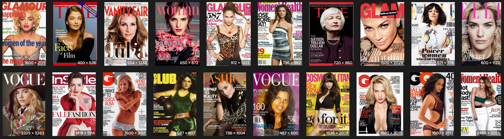
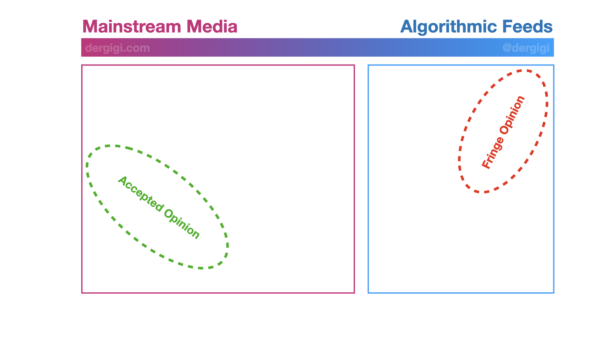
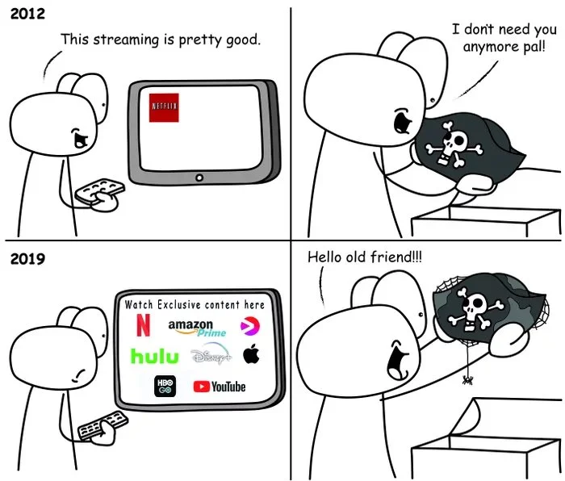

Baseado no artigo original The Freedom of Value de Gigi, esta tradução e adaptação seguem os termos disponibilizados em dergigi.com/translations, sob a licença [Creative Commons Attribution-ShareAlike 4.0 International (CC BY-SA 4.0)](https://creativecommons.org/licenses/by-sa/4.0/).

Com a palavra, o autor:

A internet tem um problema. Poucas pessoas sabem que esse problema existe, mas, veja bem, essa é a natureza dos problemas sérios e não óbvios: eles permanecem invisíveis — até que deixam de ser.
O problema da internet é que a informação quer ser livre. E, se algo quer ser livre no sentido de liberdade, com tempo suficiente, também acabará sendo livre no sentido de "gratuito".

Deixe-me explicar.

## Envenenando o Ar

Consumimos uma quantidade incalculável de dados todos os dias. A cada segundo, de cada minuto, bits e bytes percorrem os tubos invisíveis que todos conhecemos e amamos: a internet.
A gente se acostumou com isso — e também se acostumou com o modelo atual de monetização, junto com todos os problemas que ele traz. Raramente paramos para pensar nesse mundo estranho de zeros e uns. O quão incrível ele é, mas ao mesmo tempo tão distante da nossa compreensão. Já mudou completamente nossas vidas — e vai continuar mudando nosso futuro.
Mas de onde vêm esses zeros e uns? O que faz tudo isso funcionar? E, mais importante: quem está pagando por isso?

Esses bits e bytes que viajam pelos nossos cabos de fibra ótica são tão invisíveis quanto o ar que respiramos. Aliás, essa é uma boa metáfora. Enquanto conseguimos respirar sem dificuldade, não precisamos analisar cada molécula que entra nos nossos pulmões.
Do mesmo jeito, enquanto conseguimos criar e consumir conteúdo digital sem muitos problemas, não sentimos a necessidade de questionar tudo o que mantém a economia da atenção funcionando.

Economia da atenção. Que nome apropriado.
Como todos deveríamos saber, o que consumimos na internet não é de graça — estamos pagando caro por isso: com nossa atenção, entre outras coisas.

## Pagando com Atenção

No mundo acelerado de hoje, para maximizar os lucros, é preciso maximizar a atenção.
Mas é um tipo de atenção peculiar — e superficial.
Não é aquela atenção focada que o pensamento profundo ou uma conversa significativa exigiriam.
Acredito que é justamente por isso — ao menos em parte — que tanta coisa parece quebrada: por que nosso discurso social está tão fragmentado, nossa política tão polarizada, nós tão paralisados — e nossas análises, tão rasas quanto nossos desejos.

A economia da atenção nos dividiu perfeitamente em bolhas de verdades pessoais.
Ironia das ironias: a única “verdade” que realmente importa na economia da atenção é como manter o maior número possível de pessoas, no maior nível possível de indignação, pelo maior tempo possível.
E tudo isso mantendo os participantes sem perceber que estão **presos em uma prisão algorítmica construída pelas próprias escolhas que fizeram.

## Você é o Produto

O ditado “se algo é de graça, é porque você é o produto” nunca é repetido o suficiente.

Por algum motivo, criamos a expectativa de que quase tudo na internet deve ser “gratuito”.
Mas é claro que não existe almoço grátis.
No caso dos serviços online, seus dados são colhidos e vendidos para o maior lance — normalmente, uma empresa de publicidade… ou uma agência governamental. Ou as duas.

Não só todas as grandes empresas de dados espionam você, como também usam padrões obscuros (dark patterns) e práticas antiéticas para extrair até a última gota de informação sobre você.

Não importa se o nome da armadilha é Facebook Pixel, Google Analytics ou qualquer outra coisa — você está sendo rastreado, monitorado e catalogado.
O que você vê, por quanto tempo, em que horários, com que frequência e o que vai ver a seguir… tudo isso é cuidadosamente orquestrado por algoritmos otimizados para gerar lucro — lucro para a plataforma, não para você.

Claro, a ideia vendida é que todo mundo sai ganhando: usuários, criadores, anunciantes e as próprias plataformas.
Mas o “ambiente evolutivo” criado por esse sistema de incentivos acaba favorecendo conteúdo superficial, chamativo e sensacionalista.

Até o momento desta escrita — bloco 716.025 — a expressão máxima desse ambiente é o TikTok, uma verdadeira máquina de dopamina em formato de vídeo, que serve a você o equivalente visual de heroína misturada com crack.
Drogas pesadas para a mente, sob medida para seus gostos mais específicos.
Um aplicativo verdadeiramente amaldiçoado.

Infelizmente, a maioria das plataformas desse tipo não é diferente em essência — apenas em grau.

## Opinião Permitida

“Não é tão ruim assim”, dizemos para nós mesmos.
“Olha quanta informação útil!” — exclamamos, enquanto rolamos sem parar nossos feeds, alimentando sem querer a máquina que, em troca, nos alimenta com doses de dopamina.

Mas não se engane:
as empresas por trás disso tudo não estão no negócio de nos oferecer informação útil (ou verdadeira).
Elas estão no negócio de nos enganar para que continuemos alimentando a máquina.

Como poderia ser diferente?
Você é o que rastreia.
Você se torna aquilo para o qual otimiza.
Do ponto de vista da plataforma, isso significa: cliques — não qualidade.
No início, maximizar cliques e tempo de visualização pode até parecer algo inofensivo.
Afinal, é preciso gerar receita para sobreviver.
“É só um anúncio. Qual o problema?”

Infelizmente, os problemas são invisíveis no começo.
Assim como o câncer é invisível para quem acabou de fumar o primeiro cigarro,
ou a cirrose para quem bebeu o primeiro gole,
a censura, o banimento, a polarização e a manipulação da opinião pública também são invisíveis para o usuário-produtor (prosumer) que acabou de ver seu primeiro anúncio num ecossistema fechado.

E provavelmente podemos concordar: já passamos da fase inicial desse jogo.
Hoje, censura é regra, banimento é aplaudido, polarização está em níveis históricos, e a opinião pública é manipulada — manual e algorítmicamente — como nunca antes.

O consenso atual parece ser:
você é burro demais para saber o que é bom pra você.
Sua opinião é absurda demais para ser expressa em público.
E o pior:
essa opinião nem deveria ser sua em primeiro lugar.

    “Aqui está o motivo de você estar errado.”
    “Aqui está uma fonte que aponta para uma opinião permitida.”
    “Aqui estão alguns especialistas que concordam conosco.”
    “Nossos algoritmos inteligentes e prestativos já pensaram por você — e eles nunca erram.
    Nem os especialistas.”

Esse é o mundo em que já estamos vivendo.

Você não pode falar livremente.
Você não pode pensar livremente.
Você não pode se expressar livremente.

Sua foto é ofensiva? Então precisa ser removida.
Seu meme chegou perto demais da verdade, ou foi engraçado “demais”? Então você vai pra cadeia do Twitter por uma ou duas semanas.
Você disse algo com que “nós” não concordamos? Então será banido para sempre — mesmo que você seja o presidente em exercício, veja bem.
Você falou a “palavra errada” num vídeo, ou tocou uma música com direitos autorais no fundo? Então vamos cortar sua renda.
Você postou uma foto sem máscara? Então vamos te banir e te denunciar às autoridades.

O simples fato de que tudo isso já não é mais ficção científica distópica
deveria ser motivo de preocupação para todos nós.

Removidos do ciberespaço apenas por querer respirar em liberdade.
Tempos estranhos.

## Pressão Evolutiva

Como chegamos até aqui?

Se eu tivesse que dar uma resposta curta, seria a seguinte:
saímos de protocolos e passamos a viver em plataformas — e plataformas só são tão boas quanto os incentivos que as movem.

A estrutura de incentivos das plataformas que habitamos funciona como um ambiente evolutivo que determina quem sobrevive.
Tudo que quiser continuar existindo precisa se alinhar a esse ambiente.

Claro, isso não vale só para o mundo digital — é verdade em qualquer área de negócio.
Pegue as revistas impressas, por exemplo.
Por razões profundamente humanas e evolutivas, se sua revista não tiver um belo rosto feminino na capa, ela vai vender menos do que aquelas que têm.
Logo, não vai conseguir “se replicar” e, consequentemente, vai morrer.

Da mesma forma, se seu portal de notícias online não gerar receita suficiente com anúncios, ele também não vai se sustentar — e vai desaparecer.
É por isso que toda revista tem um rosto bonito na capa.
E é por isso que todo site de notícias baseado em anúncios acaba virando clickbait.

“Um desses rostos não é como os outros.”

Da mesma forma, é por isso que os mecanismos de recomendação baseados em feed acabam se transformando em caça-níqueis para os seus receptores de dopamina.

Quanto mais tempo você ficar colado na tela,
mais anúncios vai ver,
mais receita será gerada para a plataforma.

É também por isso que a maioria dos canais no YouTube vira um festival de vídeos de 7 a 15 minutos, com thumbnails mostrando alguém com a cara de quem acabou de pisar em um LEGO.
Curtos o suficiente pra te convencer a clicar,
longos o suficiente pra te fazer esquecer o que queria assistir em primeiro lugar.

Como ratos pressionando botões em caixas de Skinner hiper personalizadas, somos condicionados em ciclos de vício para maximizar o lucro dos acionistas.

## Maximizando Lucros

Plataformas são empresas, e empresas são incentivadas a maximizar os lucros dos seus acionistas.
Não há nada de errado com o lucro — e também nada de errado com os acionistas.

No entanto, acredito que a revolução da informação em que estamos inseridos dividiu o ambiente evolutivo em dois.
Vamos chamar esses dois ambientes de “amplo” e “estreito”.

Para maximizar lucros por meio de publicidade ampla, é preciso minimizar controvérsias e opiniões extremas.
Ou seja, ao tentar agradar ao denominador comum mais baixo, política e censura entram em cena automaticamente.

Por outro lado, quando os lucros vêm de publicidade segmentada e altamente direcionada, o caminho se inverte: é necessário aumentar ao máximo a controvérsia e as opiniões extremas.
Só de mostrar conteúdos diferentes para grupos diferentes, já se está amplificando a polarização e fragmentação constantemente.

Coesão de Massa vs. Divisão Algorítmica.

Pode até parecer que estamos falando de TV a cabo vs. feed algorítmico de notícias,
mas, na prática, são apenas duas estratégias diferentes com o mesmo objetivo:
manter o máximo de pessoas coladas na tela para que vejam o máximo possível de anúncios.

A primeira opção age como um sedativo, a segunda como um estimulante.

É verdade, essa caracterização pode parecer exagerada — mas o problema continua sendo o mesmo:
se não estamos pagando diretamente por algo, estamos pagando por ele de outro jeito. Sempre.

O ponto central é este: plataformas de liberdade de expressão não podem existir. Apenas protocolos de liberdade de expressão podem.

Se alguém pode controlar o que está sendo dito, então alguém vai controlar o que está sendo dito.
Se for possível monitorar, filtrar e censurar conteúdo, então isso será feito — inevitavelmente.

Toda plataforma irá se deparar com esse dilema, não importa quão puras sejam suas intenções.

Mesmo que no início você se posicione como uma “plataforma da liberdade de expressão”,
mais cedo ou mais tarde, será forçado a intervir e censurar.

Afinal, se o Estado pode te esmagar por causa do conteúdo que você hospeda ou transmite…
o Estado vai te esmagar por causa do conteúdo que você hospeda ou transmite.

## Autocensura

No entanto, muito antes da censura estatal mostrar sua face horrenda,
o efeito paralisante da autocensura já será sentido.

Se outras pessoas são banidas ou desmonetizadas por expressarem certas opiniões,
a maioria das pessoas vai pensar duas vezes antes de dizer o mesmo.
Conscientemente ou não, vamos aos poucos silenciando a nós mesmos.

E no caso da autocensura, a publicidade também tem seu papel.

Afinal, você não morderia a mão que te alimenta, certo?

No pior dos cenários, anunciantes e executivos vão dizer diretamente o que pode ser dito e o que é proibido.
Eles vão te mostrar quais opiniões estão dentro da “janela de Overton” — e quais estão fora dela.

E mesmo que eles não digam nada,
você vai tentar adivinhar — e ajustar seu discurso por conta própria.

## Um Problema e um Paradoxo

Voltando ao problema original: por que não conseguimos vender informação como se fosse um bem comum?
Por que a abordagem mais simples — colocar o conteúdo atrás de um paywall — costuma dar tão errado?

Acredito que isso acontece por dois motivos, que chamarei de “problema do MTX” e “paradoxo do DRM”.

### O Problema do MTX

MTX é a abreviação de "transação mental", e se refere ao custo psicológico inevitável envolvido em toda transação, por menor que seja.

Toda vez que você bate num paywall, precisa tomar uma decisão consciente:
“Será que vale a pena pagar por isso?”

Como Nick Szabo argumenta de forma convincente, na maioria dos casos — especialmente quando o valor é muito pequeno — a resposta será não.
E não por uma razão técnica, mas por motivos psicológicos:
o simples esforço mental de julgar se aquela microtransação vale ou não a pena já é cansativo demais.

Se você precisa pensar sobre uma microcompra, a chance de realmente realizá-la cai drasticamente.

É por isso que os modelos de assinatura e tarifa fixa reinam:
você só precisa tomar a decisão uma única vez.

Para as microtransações menores, isso vale até do ponto de vista econômico.
Usando como base um salário de US$ 20 por hora,
pensar por dois segundos se algo “vale 21 satoshis” já te custou mais de 1 centavo de dólar,
ou seja, mais do que o valor da própria microtransação.

É inviável — psicologicamente e economicamente.
Isso, em resumo, é o problema do MTX.

### O Paradoxo do DRM

Mas esse não é o único problema que afeta a monetização de conteúdo digital.
Como já mencionado, existe também o paradoxo do DRM.

DRM, ou "gestão de direitos digitais", é um esforço inútil para impedir que a informação seja copiada.
Deveria ser óbvio que informação não copiável é um contrassenso —
mas, em plena era de NFTs e outras bobagens, é melhor deixar isso claro:

    Você não pode criar informação que não possa ser copiada. Ponto.
    Como disse Bruce Schneier:
    “Tentar tornar arquivos digitais não copiáveis é como tentar fazer com que a água não seja molhada.”

Por sua própria natureza, se uma informação pode ser lida, ela também pode ser copiada — com fidelidade perfeita.Mas esse não é o único problema que afeta a monetização de conteúdo digital.
Como já mencionado, existe também o paradoxo do DRM.

DRM, ou "gestão de direitos digitais", é um esforço inútil para impedir que a informação seja copiada.
Deveria ser óbvio que informação não copiável é um contrassenso —
mas, em plena era de NFTs e outras bobagens, é melhor deixar isso claro:

    Você não pode criar informação que não possa ser copiada. Ponto.
    Como disse Bruce Schneier:
    “Tentar tornar arquivos digitais não copiáveis é como tentar fazer com que a água não seja molhada.”

Por sua própria natureza, se uma informação pode ser lida, ela também pode ser copiada — com fidelidade perfeita.
Nenhuma manobra técnica ou restrição artificial muda esse fato.

É por isso que filmes, músicas e outros conteúdos digitais sempre acabam disponíveis de graça por aí.
É muito fácil para alguém com acesso a esse conteúdo fazer uma cópia — a custo quase zero — e disponibilizá-lo para outras pessoas.

Logo, com tempo e popularidade suficientes, todo filme, toda música, todo documento acabará acessível ao público gratuitamente.
A natureza da informação não permite outro resultado.

    Por isso se diz: “A informação quer ser livre.”

Nenhuma manobra técnica ou restrição artificial muda esse fato.

É por isso que filmes, músicas e outros conteúdos digitais sempre acabam disponíveis de graça por aí.
É muito fácil para alguém com acesso a esse conteúdo fazer uma cópia — a custo quase zero — e disponibilizá-lo para outras pessoas.

Logo, com tempo e popularidade suficientes, todo filme, toda música, todo documento acabará acessível ao público gratuitamente.
A natureza da informação não permite outro resultado.

    Por isso se diz: “A informação quer ser livre.”

### Mas o paradoxo do DRM vai além — e é até engraçado.

Embora tentar criar informação incopiável já seja, por si só, uma contradição, não é disso que se trata o verdadeiro paradoxo do DRM.
Ele é ainda mais irônico — e, de novo, mais psicológico do que técnico:

    Conteúdo só continua preso atrás de paywall se for ruim.
    Se for bom, alguém vai libertá-lo.

Todo mundo sabe disso.

Se um artigo realmente vale a pena, alguém que tem acesso vai tirar print e postar nas redes sociais.
Se o filme é bom, ele vai aparecer em sites que têm barcos piratas no logotipo.
Se a música vale a audição, ela vai parar em sites de streaming gratuitos.

Só os artigos ruins, os filmes obscuros e as músicas que doem nos ouvidos continuam presos atrás de um paywall.

    Daí o paradoxo: se o conteúdo é bom, será libertado.
    Se continua trancado, é porque provavelmente não presta.

### MTX é um problema mais grave do que o DRM

Pessoalmente, acho que o problema do MTX é bem mais sério do que o paradoxo do DRM.
A solução tradicional para o MTX é o modelo de assinatura — tipo Netflix, Spotify, Amazon e por aí vai.

O paradoxo do DRM ainda existe, mas deixa de ser um problema quando o acesso "legítimo" à informação é conveniente o suficiente.

O custo de oportunidade de baixar, guardar, manter e organizar sua coleção privada de músicas é alto demais para a maioria das pessoas.
A solução mais prática é simplesmente pagar a assinatura do Spotify.

Dito isso, já começamos a ver os problemas embutidos no próprio modelo de assinaturas.

E o quadrinho a seguir ilustra isso muito bem…

Tirinha feita por /u/Hoppy_Doodle

A proliferação de plataformas de streaming te obriga a assinar Netflix, Amazon Prime, Hulu, Disney Plus, YouTube Premium — e por aí vai.
E isso é só para vídeo sob demanda.
O mesmo zoológico de assinaturas existe para música, livros, jogos, newsletters, posts de blog, etc.

Então, qual é a solução?

## Aceite a Natureza da Informação

A solução começa pela aceitação.
Vender conteúdo digital da forma tradicional, baseada em transações pontuais, não funciona — ou pelo menos não funciona muito bem.
Uma transação envolvendo uma fotografia digital de uma maçã é muito diferente de uma envolvendo uma maçã física.

George Bernard Shaw disse isso da melhor forma:
“Se você tem uma maçã e eu tenho uma maçã e trocamos essas maçãs, cada um de nós continuará tendo uma maçã.
Mas se você tem uma ideia e eu tenho uma ideia e trocamos essas ideias, cada um de nós terá duas ideias.”

Como a informação digital se comporta como uma ideia, não faz sentido torná-la artificialmente escassa.
Isso é verdade não só filosoficamente, mas também tecnicamente.
Computadores são máquinas de copiar. Sempre foram, sempre serão.
A única forma de mover informação de uma máquina para outra é copiando-a.
Isso por si só já deixa clara a futilidade de tratar informação como objetos físicos.

Quando se trata de monetizar informação na web aberta, precisamos alinhar nossa forma de pensar com a natureza da informação.
Como vimos, informação é não escassa, facilmente copiada, facilmente modificada e quer ser livre.

Acredito que o modelo certo de monetização precisa respeitar esses valores e ter propriedades semelhantes.
Ele precisa ser aberto, transparente, extensível e, por último — mas não menos importante — completamente voluntário.

Esse modelo tem um nome: valor por valor.

## Revitalizando o Artista de Rua

A ideia é simples, mas soa radical:
você oferece seu conteúdo gratuitamente, para todos, sem restrições de acesso.
Se as pessoas gostarem, se elas perceberem valor no que você oferece, você facilita para que elas devolvam valor.

Pode parecer absurdo nos dias de hoje,
mas esse modelo funciona há milhares de anos.
É o modelo dos artistas de rua, o modelo dos músicos de calçada, o modelo da doação voluntária.
No ciberespaço, porém, não enfrentamos as limitações físicas do artista de rua tradicional.
Conteúdo digital escala de maneiras que performances no mundo físico jamais conseguirão.

O modelo valor-por-valor inverte o modelo tradicional de pagamento.
Tradicionalmente, o pagamento precede o desfrute.
Na abordagem valor-por-valor, o pagamento segue o desfrute — de forma voluntária.

Você é livre para ouvir o músico de rua e seguir seu caminho,
mas — e isso a plateia intui naturalmente —
se quiser que a música continue, deve jogar algumas moedas no chapéu.

Uma coisa linda desse modelo é que ele realinha os incentivos.
Você não fica tentando maximizar cliques, tempo de visualização ou qualquer outra métrica infinita.
Você vai querer oferecer valor para sua audiência — e só isso.
E se sua audiência tiver tirado valor disso, uma porcentagem vai retribuir.
Tudo que você precisa fazer é pedir.

## Uma Alternativa Valiosa

Estamos apenas no começo dessa mudança monumental.
Minha esperança é que o modelo valor-por-valor continue a emergir como uma alternativa viável —
uma alternativa à publicidade, censura, banimento e desmonetização.

O modelo valor-por-valor remove o “eles” da equação.
Eles filtram, censuram, desmonetizam, banem.
Nem importa quem são esses “eles”.
Se um “eles” existir, ele vai encontrar um jeito de estragar tudo.

Valor-por-valor elimina o “eles” e coloca você no comando.
Você é o governante no reino do um, único responsável pelos seus pensamentos e sua fala.
Se quisermos liberdade (e salvação) no ciberespaço, precisamos colocar o indivíduo no controle novamente.
Como sempre, liberdade e independência exigem responsabilidade.

No melhor dos mundos, os criadores são incentivados a fazer apenas uma coisa: criar.
Atendendo só a si mesmos e àqueles interessados em suas criações.
Sem intermediários.
Direto, pessoa a pessoa, valor por valor.

## O Que Está Por Vir

É verdade que, hoje, não é tão simples hospedar sua própria infraestrutura.
É intimidante rodar seu próprio nó para receber pagamentos de forma autosoberana.
Mas, além de ficar mais fácil, isso será cada vez mais necessário.

Além de facilitar tudo, precisamos estar atentos ao problema do MTX descrito acima.
Cada passo que reduzir o custo mental das transações no ecossistema valor-por-valor é um passo na direção certa.

A capacidade de valor do [Podcasting 2.0](https://podcastindex.org/) é um desses passos.
Ela permite e automatiza pagamentos por minuto, sem nenhuma interação extra do usuário.
Uma vez configurado, sua carteira fará os pagamentos automaticamente.

Acredito que futuras versões dessa ideia poderão ser integradas a todos os tipos de mídia,
seja áudio, vídeo, imagens, texto e por aí vai.
Acredito que estamos perto da versão protocolar do Patreon:
todos os benefícios de zerar os custos mentais de transação,
sem o atrito e a censura inerentes a uma solução baseada em plataforma.

Se isso virá na forma de pagamentos recorrentes [BOLT12](http://bolt12.org/) ou algo totalmente diferente ainda é cedo para dizer.
Tenho confiança, no entanto, de que vai chegar — e a seu tempo.

## Conclusão

Não só nosso dinheiro fiduciário está quebrado, como também o modelo de monetização da internet está falho.
As plataformas baseadas em publicidade dos dias de hoje otimizam o engajamento por meio da divisão e polarização, usando padrões obscuros e vício planejado.

Não será fácil escapar dos ciclos compulsivos que foram armados para nós,
mas graças à pilha tecnológica autosoberana que está surgindo,
existe uma alternativa viável: o modelo valor-por-valor.

O modelo de monetização do “artista de rua” funcionou por muitos séculos no passado,
e graças ao Bitcoin e à Lightning Network, estou confiante de que funcionará por muitos séculos no futuro.
Estamos quase lá.
Só precisamos descobrir como posicionar o chapéu corretamente no chão e quais são os melhores lugares da cidade para se apresentar, por assim dizer.

Valor-por-valor elimina completamente o paradoxo do DRM e — com o nível certo de automação e configurações sensatas —
também resolverá o problema do MTX.

Se acertarmos isso, poderemos nos libertar do ambiente evolutivo de sobrevivência do mais rico das plataformas,
permitindo que entremos no reino quase imortal dos protocolos.

Há muito a explorar, muitas ferramentas a construir e muitas noções preconcebidas a serem quebradas.
Uma mudança sísmica está acontecendo bem diante dos nossos olhos,
e estou ansioso para surfar essas ondas com todos vocês.
Avante!